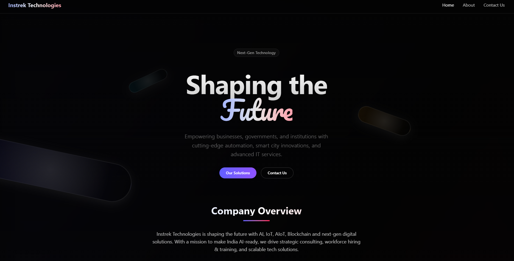
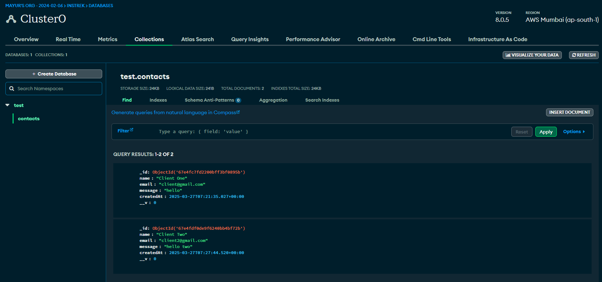

# Instrek Technologies - Website

A modern, animated tech company website built with Next.js featuring a contact form that stores submissions in MongoDB.

## 🚀 Technologies Used

### Frontend
- **Next.js 15** - React framework with App Router
- **React 19** - UI library
- **Framer Motion** - For smooth animations and transitions
- **Tailwind CSS** - Utility-first CSS framework
- **shadcn/ui** - Reusable UI components (Button, Card, Dialog, etc.)

### Backend
- **Next.js API Routes** - Serverless API endpoints
- **MongoDB** - NoSQL database for storing contact form submissions

### Deployment
- **Vercel** - Hosting platform optimized for Next.js applications

## 📦 Project Structure

- `src/app` - Next.js app router pages
- `src/components` - Reusable React components
- `src/lib` - Utility functions and database connection
- `src/models` - MongoDB schemas
- `public` - Static assets

## 📊 Database

Contact form submissions are stored in MongoDB. Below is a screenshot of the database structure:

### Contact Schema